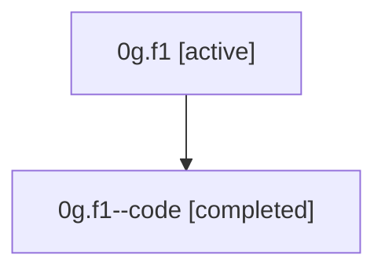

# Family: 0g.f1

[Agent Hoods](../README.md) / [bbugyi200](../users/bbugyi200/README.md) / [athena](../users/bbugyi200/machines/athena/README.md) / [0g](../users/bbugyi200/machines/athena/hoods/0g/README.md) / 0g.f1

Owner: `bbugyi200.athena` · Hood: `0g` · Members: 2

## Lineage

The diagram is an optional enhancement; the ordered table below contains the same lineage in accessible text.

| Role | Agent | State | Model / provider | Timing | Commits | Prompt | Chat |
|---|---|---|---|---|---:|---|---|
| root | 0g.f1 | active | gpt-5.5 / codex | 2026-07-07T15:56:31.653166+00:00 | [1](../agents/bbugyi200.athena.0g.f1/README.md#commits) | [Prompt](../agents/bbugyi200.athena.0g.f1/prompt.md) | [Chat](../agents/bbugyi200.athena.0g.f1/chat.md) |
| code | 0g.f1--code | completed | gpt-5.5 / codex | 2026-07-07T15:59:50.637178+00:00 | [1](../agents/bbugyi200.athena.0g.f1--code/README.md#commits) | — | [Chat](../agents/bbugyi200.athena.0g.f1--code/chat.md) |

## Commits

| Role | Repo | Commit | Subject | Committed |
|---|---|---|---|---|
| root | actstat | [`acfd00c`](https://github.com/bbugyi200/actstat/commit/acfd00c98d4d09703de0d6b56b983592651fe257) | chore: Add SDD prompt and plan for single\_running\_actions\_run | 2026-07-07 11:59:49 EDT |
| code | actstat | [`85fb6bc`](https://github.com/bbugyi200/actstat/commit/85fb6bcfbb9d4d3b354b0e18cd9bf0a2b2220726) | feat!: show only the running workflow run | 2026-07-07 12:09:22 EDT |

## Neighbors

| Agent | Relation | State |
|---|---|---|
| [0g](bbugyi200.athena.0g.md) (family · 2) | ancestor | active 1, completed 1 |
