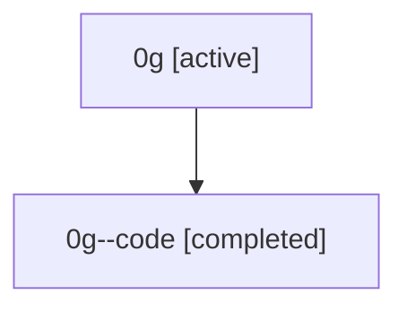

# Family: 0g

Owner: `bbugyi200.athena` · Hood: `0g` · Members: 2

## Lineage

The diagram is an optional enhancement; the ordered table below contains the same lineage in accessible text.

| Role | Agent | State | Model / provider | Timing | Commits | Prompt | Chat |
|---|---|---|---|---|---:|---|---|
| root | 0g | active | claude-fable-5 / claude | 2026-07-07T15:34:46.343978+00:00 | 2 | [Prompt](../agents/bbugyi200.athena.0g/prompt.md) | [Chat](../agents/bbugyi200.athena.0g/chat.md) |
| code | 0g--code | completed | gpt-5.5 / codex | 2026-07-07T15:41:35.963016+00:00 | 1 | — | [Chat](../agents/bbugyi200.athena.0g--code/chat.md) |
