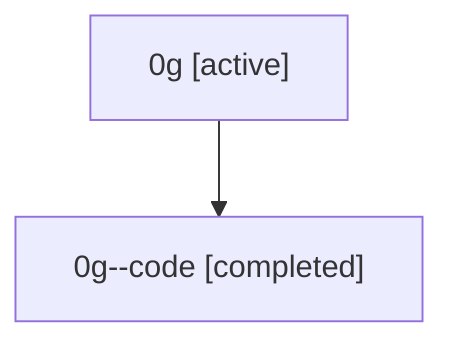

# Family: 0g

[Agent Hoods](../README.md) / [bbugyi200](../users/bbugyi200/README.md) / [athena](../users/bbugyi200/machines/athena/README.md) / [0g](../users/bbugyi200/machines/athena/hoods/0g/README.md) / 0g

Owner: `bbugyi200.athena` · Hood: `0g` · Members: 2

## Lineage

The diagram is an optional enhancement; the ordered table below contains the same lineage in accessible text.

| Role | Agent | State | Model / provider | Timing | Commits | Prompt | Chat |
|---|---|---|---|---|---:|---|---|
| root | 0g | active | claude-fable-5 / claude | 2026-07-07T15:34:46.343978+00:00 | [2](../agents/bbugyi200.athena.0g/README.md#commits) | [Prompt](../agents/bbugyi200.athena.0g/prompt.md) | [Chat](../agents/bbugyi200.athena.0g/chat.md) |
| code | 0g--code | completed | gpt-5.5 / codex | 2026-07-07T15:41:35.963016+00:00 | [1](../agents/bbugyi200.athena.0g--code/README.md#commits) | — | [Chat](../agents/bbugyi200.athena.0g--code/chat.md) |

## Commits

| Role | Commit | Subject | Committed (UTC) |
|---|---|---|---|
| root | [`3a19944`](https://github.com/bbugyi200/actstat/commit/3a19944c2b33285bb411fa0bc20b7ef2be049655) | chore: Add SDD prompt and plan for active\_runs | 2026-07-07 15:41:34 |
| code | [`d7497b2`](https://github.com/bbugyi200/actstat/commit/d7497b28720c4f16be5d36c92e7693b43db5e534) | feat: show active workflow runs | 2026-07-07 15:51:26 |
| root | [`d7497b2`](https://github.com/bbugyi200/actstat/commit/d7497b28720c4f16be5d36c92e7693b43db5e534) | feat: show active workflow runs | 2026-07-07 15:51:26 |

## Neighbors

| Agent | Relation | State |
|---|---|---|
| [0g.f1](bbugyi200.athena.0g.f1.md) (family · 2) | descendant | active 1, completed 1 |
